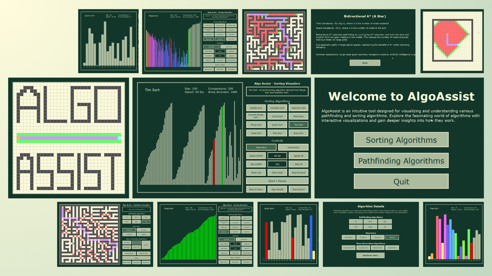

# AlgoAssist

## Project Overview

AlgoAssist is an interactive visualizer built to help users understand sorting and pathfinding algorithms through clear and engaging visual demonstrations. Designed for educational purposes, AlgoAssist offers a hands-on approach to learning complex algorithms, making it perfect for students, educators, and enthusiasts. The project leverages Pygame and runs as a standalone app, providing an intuitive interface to explore the mechanics of both sorting and pathfinding in real time.

## Features

- **Two-in-One Visualizer:** AlgoAssist combines both a sorting and pathfinding app in a single platform. Users can easily switch between exploring sorting algorithms and pathfinding algorithms.

- **Sorting Algorithm Visualizer:** Explore 12 sorting algorithms, customize speed, list size, and sorting order, and track real-time metrics like comparisons and array accesses. Step mode allows for step-by-step visualization of sorting.

- **Pathfinding Algorithm Visualizer:** Choose from 6 pathfinding algorithms, 4 heuristics, and 4 maze generation methods. Customize mazes, track visited nodes and path length, and visualize algorithm performance in real-time.

- **Educational Focus:** Designed for students and enthusiasts, AlgoAssist provides algorithm insights, making complex concepts easier to grasp through interactive learning.


## Tech Stack

**Language:** Python

**Framework/Library:** Pygame

**Development Environment:** Runs as a standalone app

## Distinctiveness and Complexity


AlgoAssist goes beyond typical course projects with its interactive, customizable visualizations, real-time metrics, and in-depth algorithm insights, offering a more engaging learning experience.

  - **Two-in-One Platform**: AlgoAssist integrates both sorting and pathfinding algorithms into a single application, allowing users to seamlessly switch between exploring different algorithm types, making it versatile and comprehensive.

  - **Step-by-Step Visualization**: With Step Mode, users can slow down and examine each individual step of sorting algorithms, making it easy to understand how comparisons and swaps occur, providing a deeper insight into algorithm mechanics.

  - **Color-Coded Visualizations**: Intuitive color schemes enhance the learning process by highlighting key elements. In sorting, colors indicate elements being compared, swapped, or finalized. In pathfinding, different colors show visited nodes, nodes to visit, and the final path, making it easy to track algorithm progress.

  - **Customizable Features**: AlgoAssist provides extensive customization for both sorting and pathfinding algorithms. Select from 12 sorting algorithms (e.g., Quick Sort, Heap Sort) with options to adjust speed, list size, and sorting order. In the pathfinding app, choose from 6 algorithms (e.g., A*, Dijkstra), modify heuristics, and select from various maze generation methods. Users can also create custom mazes by adding barriers for more tailored algorithm testing.

  - **Real-Time Metrics**: Get live feedback on performance. In sorting, the app displays comparisons and array accesses in real-time, while in pathfinding, it tracks the number of nodes visited and the path length when a solution is found.

  - **Detailed Algorithm Insights**: For both sorting and pathfinding, users can access time complexity, space complexity, and common applications, bridging the gap between theoretical learning and practical understanding.

  - **Maze Generation & Customization**: The pathfinding app includes 4 maze generation algorithms and allows users to create custom barrier placements, encouraging users to experiment and see how algorithms perform in varied environments.

In summary, AlgoAssist offers an intuitive interface, detailed visualizations, and customizable settings, making it an ideal tool for students, educators, and enthusiasts looking to explore and understand sorting and pathfinding algorithms in-depth.
## File Structure Overview

### AlgoAssist Project Directory (`AlgoAssist/`)

- `pathfinding/`: Directory for all pathfinding-related files and logic.
  - `constants.py`: Stores constants used in the pathfinding algorithms and visualization.
  - `grid.py`: Handles grid-related operations for pathfinding.
  - `heuristics.py`: Contains the heuristic functions used in pathfinding.
  - `main.py`: Main entry point for the pathfinding app.
  - `maze_algorithms.py`: Contains algorithms for generating mazes 
  - `pathfinding_algorithms.py`: Implements various pathfinding algorithms.
  - `visualizer.py`: Handles the visual representation of the pathfinding algorithms.
  
- `sorting/`: Directory for sorting algorithm visualization.
  - `constants.py`: Stores constants used in the sorting algorithms and visualization.
  - `draw_utils.py`: Utility functions for drawing and updating the sorting visualization.
  - `helpers.py`: Helper functions for sorting visualization operations.
  - `main.py`: Main entry point for the sorting app.
  - `sorting_algorithms.py`: Implements various sorting algorithms.
  - `visualizer.py`: Handles the visual representation of the sorting algorithms.
  
- `algorithms_info.py`: Contains detailed information about both pathfinding and sorting algorithms, including time complexity, space complexity, and common uses.

- `menu_states.py`: Manages the different menu states (e.g., switching between sorting and pathfinding).

- `pages.py`: Manages the rendering of different pages or sections in the application.

- `project.py`: Main entry point for the AlgoAssist program, which combines both sorting and pathfinding apps. It also contains three custom functions required for running the app.

- `test_project.py`: Contains simple unit tests for the custom functions and other functionalities within the project.py.

- `ui.py`: Handles the UI components and layout for the application.


### Other Important Files

- `requirements.txt`: Python dependencies for the project (e.g., Pygame).
- `venv/`: Virtual environment for managing project-specific Python packages.
## How to Run

Clone the project

```bash
  git clone https://github.com/bonjourmontreal/algoassist

```

Go to the project directory

```bash
  cd algoassist
```

Install dependencies

```bash
  pip install -r requirements.txt
```

Run the application:

```bash
  python main.py
```


## Additional Information

This application is developed for educational purposes as part of the CS50p Python course's final project.


## Future Enhancements

### General Improvements

- **General Improvements:**
    - Web Application: Migrate AlgoAssist to a web-based application using React for a more interactive and accessible user experience.
    - Code Optimization: Refactor code for better separation of concerns, such as moving drawing logic from visualizer.py to a drawing_utils module. Optimize menu rendering, instructions, and algorithm details pages for smoother navigation.

- **Sorting Visualizer Improvements:**
    - New Algorithms: Add non-comparison-based sorting algorithms such as Radix Sort (LSD/MSD) and Bucket Sort to diversify the available sorting options.
    - Pseudo Code Visualization: Introduce a pseudo code visualizer to run alongside the sorting visualization, particularly helpful in Step Mode for a deeper understanding of the algorithm's logic.
    - Advanced Visualizations: Introduce new types of visualizations beyond bars, such as:
    - Scatter Plots: Visualize the sorting process with points moving vertically as they are sorted.
    - Circular Layouts: Arrange elements in a circle, visualizing sorting through rotation or movement along the circumference.
    - Radial Visualizations: Display sorting progress radiating outward from a central point, highlighting swaps and comparisons dynamically.
    - Sound Integration: Incorporate sound effects during sorting operations to make the experience more engaging, with auditory feedback corresponding to comparisons, swaps, or algorithm steps.
    - Step Back Feature: Add a "Step Back" feature in Step Mode, allowing users to reverse the algorithm step-by-step for deeper exploration and understanding.

- **Pathfinding Visualizer Improvements:**
    - Weighted Graphs: Implement Dijkstra’s Algorithm with support for weighted graphs, offering more practical real-world scenarios in pathfinding.
    - Diagonal Jumping: Add an option for diagonal movement in the pathfinding algorithms, with customizable costs for diagonal moves.
    - Visualization Delays: Introduce customizable delays for pathfinding algorithms and maze generation to better visualize their step-by-step process.
    - Random Maze Generation: Add more random maze generation options to create varied and complex mazes with a single click.
    - Sound Integration: Implement sound effects during the execution of pathfinding algorithms to enhance the visualization experience.
      
## Demo

### Youtube Demo:

[](https://www.youtube.com/watch?v=SLKWunW-vy4)


